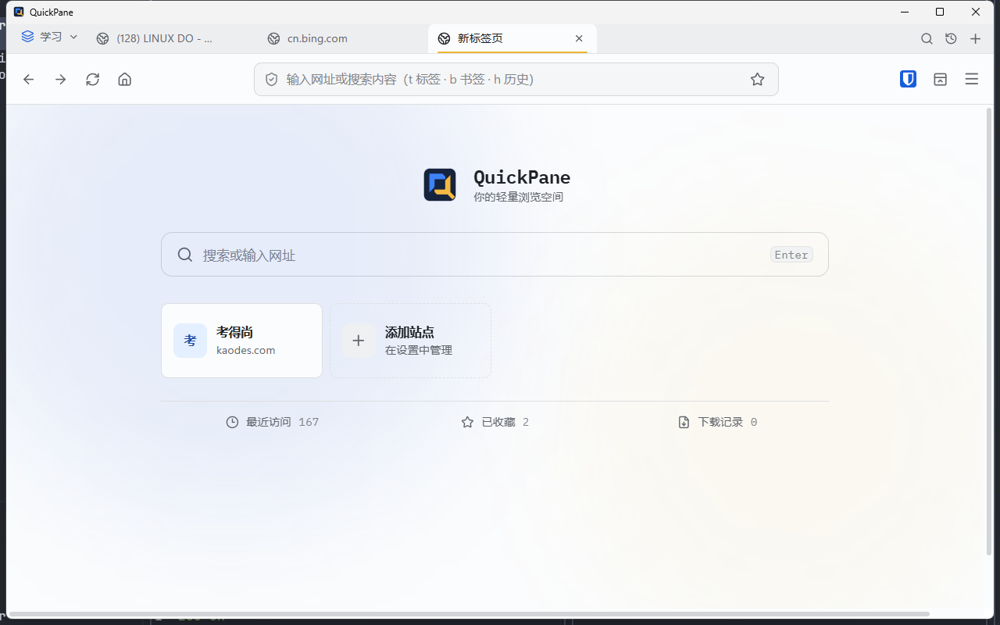
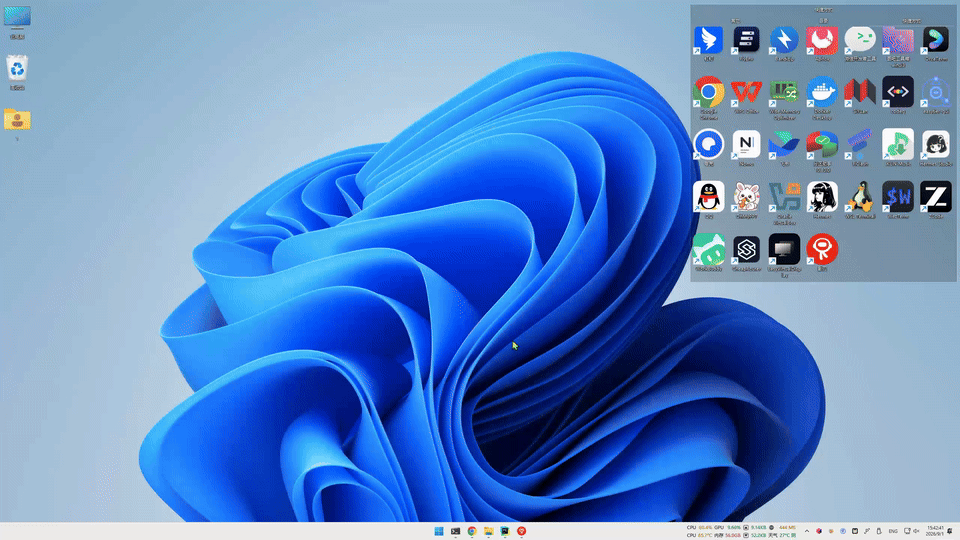
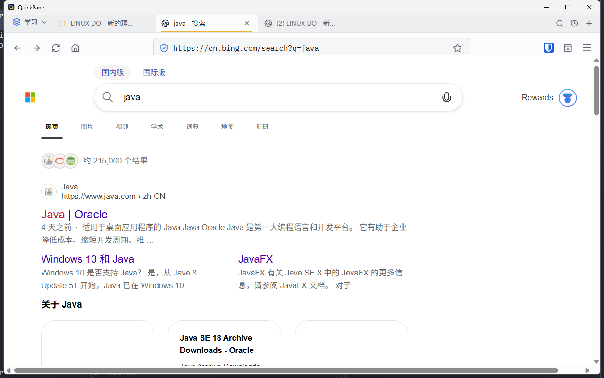
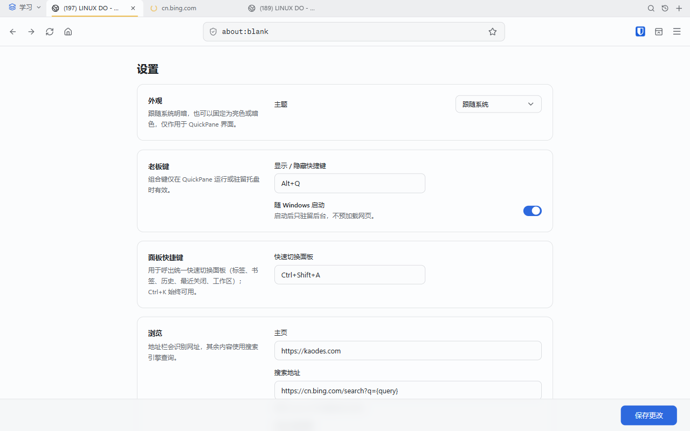
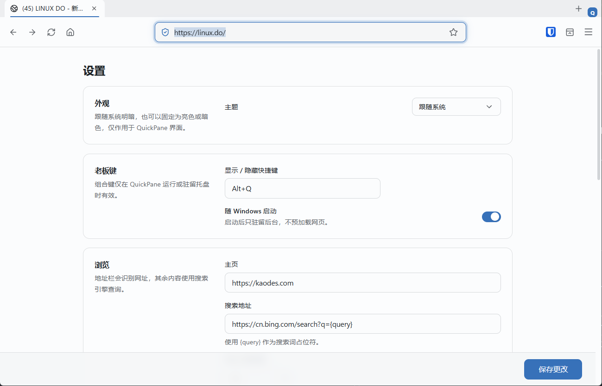
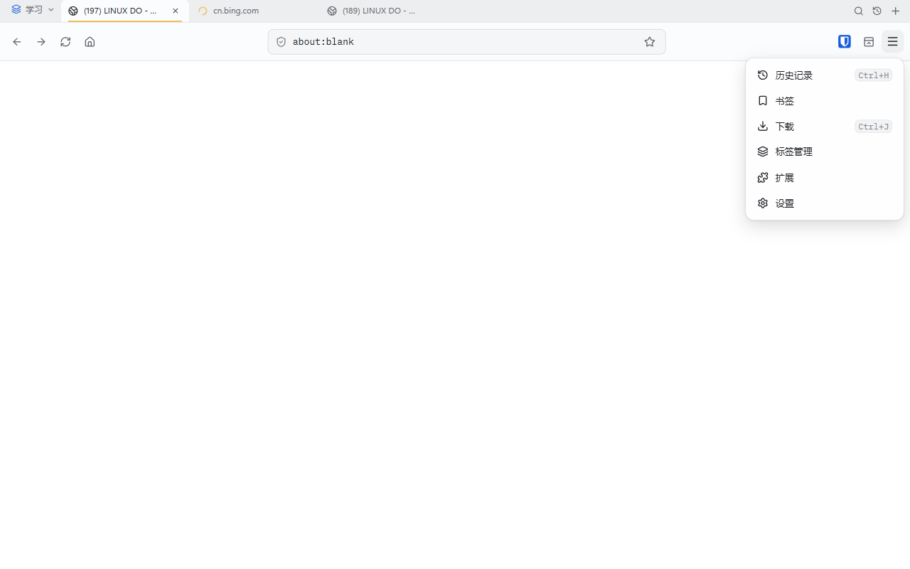

<div align="center">


# QuickPane

**Press one hotkey to bring up the browser. Press it again to get back to work.**

A lightweight browser for Windows. Keep tabs, history, bookmarks and extensions close at hand without keeping another browser window on your taskbar.

[Download latest](https://github.com/zxbdzh/QuickPane/releases/latest) · [Report an issue](https://github.com/zxbdzh/QuickPane/issues) · [中文](README.md)


</div>

<p align="center">
  
</p>

<p align="center"><sub>The QuickPane interface: a lightweight browser ready when you need it.</sub></p>

<p align="center">
  
</p>

---

## Why QuickPane

A browser should be available when you need it, without constantly taking up taskbar space or attention.

QuickPane runs in the background and uses one global hotkey to show or hide the entire browser window. Tabs and browsing sessions stay available, media is muted while hidden, and the previous foreground window is restored when QuickPane disappears.

## Screenshots

<p align="center">
  
  
</p>
<p align="center">
  <sub>Web browsing: open sites in dedicated tabs with address-bar navigation, back, forward and reload.</sub>
  <sub>Settings: customize the privacy hotkey, panel shortcut, home page, search engine, tab hibernation, proxy and app lock.</sub>
</p>
<p align="center">
  
  
</p>
<p align="center">
  <sub>Extension manager: install, enable, disable and remove unpacked browser extensions.</sub>
  <sub>Quick menu: reach history, bookmarks, downloads, tab manager, lock, extensions and settings.</sub>
</p>

## GitHub Stars

[](https://github.com/zxbdzh/QuickPane/stargazers)

Star QuickPane if it is useful to you. The count is updated automatically by GitHub.

## Quick Start

1. Download the Windows installer from [Releases](https://github.com/zxbdzh/QuickPane/releases/latest).
2. Launch QuickPane and set a privacy hotkey in Settings to show or hide the window. If none is set, use the tray icon.
3. Press `Ctrl+K` or the default `Ctrl+Shift+A` to open the quick switch panel. Enter a URL or search query in the address bar.
4. Press the privacy hotkey or `Esc` to hide the window and continue the session later.

## Keyboard Shortcuts

The privacy hotkey (show / hide) and the quick switch panel shortcut are both configurable in Settings. A shortcut must include at least one modifier and one regular key, such as `Alt+Q` or `Ctrl+Alt+B`. `Ctrl+K` always opens the quick switch panel.

| Action | Shortcut |
| --- | --- |
| Show / hide window | Privacy hotkey in Settings; otherwise the tray icon |
| Hide window | `Esc` |
| Quick switch panel | `Ctrl+K` or the panel shortcut in Settings (default `Ctrl+Shift+A`) |
| Recently closed tabs | Clock button on the tab strip, or filter inside the quick switch panel |
| Switch to next tab | `Ctrl+Tab` |
| Switch to previous tab | `Ctrl+Shift+Tab` |
| New tab | `Ctrl+T` |
| Restore closed tab | `Ctrl+Shift+T` |
| Close current tab | `Ctrl+W` |
| Back | `Alt+Left` |
| Forward | `Alt+Right` |
| Reload | `Ctrl+R` |
| Focus address bar | `Ctrl+L` |
| Bookmark current page | `Ctrl+D` |
| Open history | `Ctrl+H` |
| Open downloads | `Ctrl+J` |
| Find in page | `Ctrl+F` |
| Zoom in / out / reset | `Ctrl+=` / `Ctrl+-` / `Ctrl+0` |

## Features

### Quick Switch and Workspaces

- Press `Ctrl+K` to search current tabs, recently closed tabs, workspaces, session snapshots, bookmarks and history in one panel.
- Search Chinese titles by pinyin, move through results with the keyboard and press Enter to open an item.
- Use `t` for tabs, `b` for bookmarks and `h` for history in the address bar; tab results can be copied, closed or moved to another workspace.
- Click the workspace name in the top-left corner to create, switch, rename or delete a workspace. The current workspace is persisted.
- Choose **Save snapshot** in the workspace menu, or open **Tab manager** from the top-right menu to save the current tab set. Later, search the snapshot in the quick switch panel and restore it in place or into a new workspace.
- Open **Tab manager** from the top-right menu to filter tabs by title, URL or domain, then bookmark, mute, move or close them in batches.

### Appears when needed

- Show or hide the window instantly with a global hotkey
- Mute web media while hidden
- Restore the previous foreground window after hiding
- Run from the system tray and minimize to tray on close

### Persistent browsing sessions

- Multiple tabs in one window
- Persistent tabs, history, bookmarks, recently closed pages, workspaces and session snapshots
- URL navigation, search and tab / bookmark / history source search from the address bar
- Regular web links and new-tab links inside the same browser session
- Downloads, page zoom and background tab hibernation

### Browser capabilities

- Powered by Windows WebView2
- Install, enable, disable and remove unpacked browser extensions (CRX files are not installed directly)
- Settings cover tab hibernation, network proxy, app lock, theme, quick links and signed automatic updates
- Optional tab hibernation releases long-idle background WebViews and reloads them when you switch back
- Optional Argon2id app lock protects the UI; it does not encrypt the WebView2 data directory
- Optional start with Windows, staying in the background until you show the window

## Requirements

- Windows 10 or Windows 11
- Windows WebView2 Evergreen Runtime
- x64 Windows

The installer checks for WebView2 Runtime. If it is missing, the installer downloads and installs it when needed.

## FAQ

### Is QuickPane a full browser replacement?

QuickPane is a lightweight browser for quick research, documentation and short-lived browsing sessions. It is not intended to replace the full ecosystem of Chrome, Edge or Firefox.

### Where is my data stored?

Tabs, settings, history, bookmarks, workspaces and session snapshots are stored in `%APPDATA%\QuickPane\quickpane.json`. Page cache, cookies and login state use a separate WebView2 data directory under the same application data folder.

### Does the app lock leak data?

The app lock only protects the UI. While locked or during first-run password setup, the frontend snapshot is redacted, so history, bookmarks, tabs and session snapshots are not sent over IPC to the unlocked UI. It does not encrypt `quickpane.json` or the WebView2 data directory on disk.

### Why does QuickPane require WebView2?

QuickPane uses the native Windows WebView2 engine to render web pages. This reuses the system browser engine while keeping the application relatively small.

### How do I install extensions?

Only unpacked extension folders with a `manifest.json` are supported. Choose a folder on the extensions page. Unpack a CRX file first if needed. See [docs/extensions.md](docs/extensions.md).

### How do I report a problem?

Open a [GitHub Issue](https://github.com/zxbdzh/QuickPane/issues) with your Windows version, QuickPane version, reproduction steps and relevant screenshots.

## Development

Requirements: Node.js 20+, pnpm, the Rust toolchain and WebView2 Runtime.

```bash
npm install
npm run tauri dev
```

Useful checks:

```bash
npm test
npm run build
cargo check --manifest-path src-tauri/Cargo.toml
```

In development, the main WebView2 opens CDP at `http://127.0.0.1:9222/json`. Override the port with `QUICKPANE_CDP_PORT`, or set it to `0` to disable. Release builds leave CDP off. Tab WebViews use a separate WebView2 environment and cannot share this port.

See [AGENTS.md](AGENTS.md) for architecture boundaries and repository conventions. See [docs/release.md](docs/release.md) for the release and auto-update process.

## Contributing

Bug fixes, documentation improvements and feature ideas are welcome. For larger changes, please discuss the approach in [Issues](https://github.com/zxbdzh/QuickPane/issues) first.

## License

[MIT](LICENSE)
